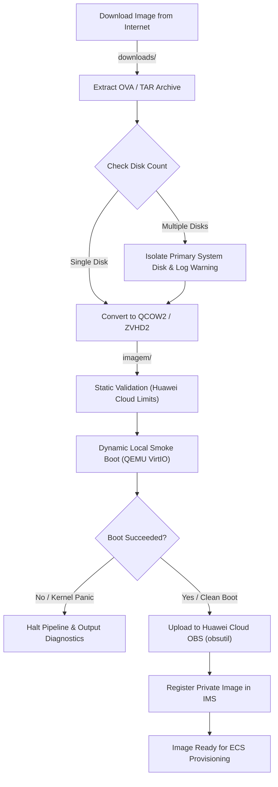

# Pipeline Workflow & Safeguards Guide

## End-to-End Execution Flow

## Reliability & Safety Guarantees
1. **Non-Destructive Testing**: Test boots execute using QEMU copy-on-write snapshots (`snapshot=on`). Master disk images are never modified.
2. **Early Failure Detection**: The pipeline halts immediately if a disk fails any IMS requirement (e.g., secondary attached disk, missing VirtIO drivers, or hardcoded fstab device names).
3. **Cloud Cost & Bandwidth Efficiency**: Zero OBS egress/ingress traffic is generated if an image fails local validation.
