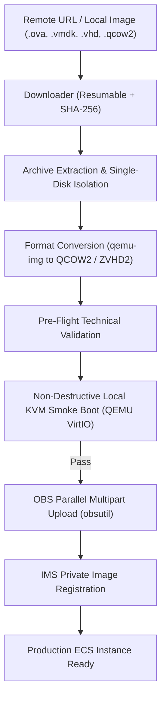

# Huawei Cloud IMS Image Factory for Antigravity

[](LICENSE)
[](https://support.huaweicloud.com/intl/en-us/ims/index.html)
[](https://antigravity.google/docs/projects/)

An automated engineering pipeline and skill suite for [Google Antigravity](https://antigravity.google/) to ingest, convert, validate, and upload custom operating system disk images to **Huawei Cloud Image Management Service (IMS)** and **Object Storage Service (OBS)**.

Built around official Huawei Cloud requirements, this factory strictly enforces platform constraints—such as single-disk system image rules, VirtIO KVM driver readiness, fstab UUID mounting, and thin-provisioned sparse conversions.

---

## Architecture Overview



---

## Key Features

- **Strict Single-Disk Enforcement**: Automatically unpacks complex multi-disk OVA/OVF containers and isolates the primary boot disk (`disk-0`) for System Disk Image import, preventing cloud-side rejection.
- **Universal Format Support**: Converts and validates VMware (`.ova`, `.vmdk`), Hyper-V (`.vhd`, `.vhdx`), QEMU (`.qcow2`, `.qed`), VirtualBox (`.vdi`), RAW images (`.raw`, `.img`), and Huawei proprietary formats (`.zvhd`, `.zvhd2`).
- **Pre-Flight Compliance Engine**: Validates disk geometry, boundary sizes (10–1024 GB for Linux, 20–1024 GB for Windows), partition table schemes (MBR/BIOS vs GPT/UEFI), Cloud-Init services, and fstab UUID entries before consuming bandwidth.
- **Non-Destructive Local KVM Simulation**: Spawns a headless QEMU virtual machine matching Huawei Cloud ECS virtual hardware (`virtio-blk`, `virtio-net`) in snapshot mode (`snapshot=on`) to verify kernel boot and rule out Kernel Panics before upload.
- **Resilient Cloud Transfers**: Leverages Huawei's official multi-threaded `obsutil` CLI (with automatic fallback to Python SDK) for parallel multipart transfers with MD5 integrity verification.
- **Antigravity Native**: Fully packaged as modular Antigravity skills (`.agents/skills/`) and project rules (`AGENTS.md`, `GEMINI.md`).

---

## Workspace Layout

```text
.
├── .agents/
│   ├── rules/
│   │   └── huawei_ims_rules.md      # Platform rules enforced by agents
│   └── skills/                      # Modular Antigravity skills
│       ├── ims-downloader/          # Resumable download with hash check
│       ├── ims-extractor-converter/ # Package unpacker & single-disk converter
│       ├── ims-local-validator/     # Static inspector & local boot tester
│       ├── ims-cloud-uploader/      # High-speed OBS multipart uploader
│       ├── ims-cloud-importer/      # IMS API registrar & job tracker
│       └── ims-pipeline-orchestrator/ # End-to-end pipeline runner
├── docs/ (documentacao/)
│   ├── manual_portal_creation.md    # Web console step-by-step walkthrough
│   ├── huawei_ims_specifications.md # Official Huawei Cloud specifications
│   ├── env_vars_guide.md            # IAM credentials and environment configuration
│   ├── guest_os_preparation_linux.md # Linux guest setup (VirtIO, Cloud-Init, fstab)
│   ├── guest_os_preparation_windows.md # Windows Server guest setup
│   └── supported_image_matrix.md    # Format comparison & recommendations
├── wiki_guide/
│   ├── README.md                    # Wiki overview
│   ├── agent_workflow.md            # Agent cognitive flow & decision tree
│   ├── local_testing_guide.md       # QEMU VirtIO smoke boot mechanics
│   └── troubleshooting.md           # Common failures & runbooks
├── scripts/
│   ├── setup_prerequisites.sh       # Dependency bootstrap & installer
│   ├── download_image.py            # Download utility
│   ├── extract_and_convert.py       # Extraction & conversion utility
│   ├── validate_image.py            # Static image inspector
│   ├── test_local_boot.py           # Headless boot smoke tester
│   ├── upload_to_obs.py             # OBS upload utility
│   ├── import_ims_image.py          # IMS image registration client
│   ├── pipeline.py                  # End-to-end unified CLI
│   └── huawei_env.sh.example        # Environment variables template
├── downloads/                       # Inbound downloaded images (.gitkeep)
├── extracao_imagem/                 # Scratch folder for archive extraction (.gitkeep)
├── imagem/                          # Converted output images & manifests (.gitkeep)
├── AGENTS.md                        # Senior Cloud Engineer persona & directives
├── GEMINI.md                        # Workspace context pointers
└── requirements.txt                 # Python dependencies
```

---

## Quickstart

### 1. Bootstrap Prerequisites
Run the dependency bootstrap script to verify system packages and configure a local Python virtualenv:
```bash
./scripts/setup_prerequisites.sh
```

To install QEMU tools globally on Ubuntu/Debian:
```bash
sudo apt-get update && sudo apt-get install -y qemu-utils qemu-system-x86
```

### 2. Configure Environment Variables
Copy the template and configure your Huawei Cloud credentials:
```bash
cp scripts/huawei_env.sh.example scripts/huawei_env.sh
chmod 600 scripts/huawei_env.sh
nano scripts/huawei_env.sh
source scripts/huawei_env.sh
```

Required environment variables:
```bash
export HWC_AK="your-access-key-id"
export HWC_SK="your-secret-access-key"
export HWC_REGION="sa-brazil-1"
export HWC_OBS_BUCKET="your-obs-bucket"
export HWC_OBS_ENDPOINT="https://obs.sa-brazil-1.myhuaweicloud.com"
```

### 3. Run the Pipeline

#### From a remote URL:
```bash
python3 scripts/pipeline.py \
    --url "https://download.lenovo.com/servers/mig/2026/07/16/65007/lnvgy_sw_xc1_26p.2.0_vmware_indiv.ova" \
    --format qcow2 \
    --os-type linux
```

#### From a local file (e.g., exported VMware OVA):
```bash
python3 scripts/pipeline.py \
    --input "downloads/my_server.ova" \
    --format qcow2 \
    --os-type linux
```

#### Dry-run mode (offline verification):
```bash
python3 scripts/pipeline.py \
    --input "downloads/my_server.ova" \
    --format qcow2 \
    --dry-run
```

---

## Individual Utilities

Each pipeline stage can also be executed independently:

```bash
# 1. Download image with resume and SHA-256 check
python3 scripts/download_image.py --url "<URL>" --output-dir downloads/

# 2. Extract multi-disk OVA and convert primary disk to QCOW2
python3 scripts/extract_and_convert.py --input downloads/appliance.ova --format qcow2

# 3. Static compliance validation
python3 scripts/validate_image.py --image imagem/appliance.qcow2 --os-type linux

# 4. Local headless boot smoke test (30s snapshot)
python3 scripts/test_local_boot.py --image imagem/appliance.qcow2 --timeout 30

# 5. Upload to OBS bucket
python3 scripts/upload_to_obs.py --image imagem/appliance.qcow2

# 6. Register private image in IMS
python3 scripts/import_ims_image.py --manifest imagem/appliance.qcow2.obs_upload.json
```

---

## Tested Real-World Appliances

- **Lenovo XClarity One Portal Full v26.2** (`lnvgy_sw_xc1_26p.2.0_vmware_indiv.ova`):
  - Ingested 5.21 GB OVA container.
  - Automatically decomposed 2 VMDK disks, isolating the 240 GB primary boot disk.
  - Converted to thin-provisioned QCOW2 (15.26 GB physical size).
  - Validated compliance and uploaded directly to `obs://brsp01sharimg01/` via `obsutil`.

---

## Contributing & License

Contributions are welcome! Please submit pull requests or open issues for feature requests.

Distributed under the **Apache License 2.0**. See [LICENSE](LICENSE) for more information.
